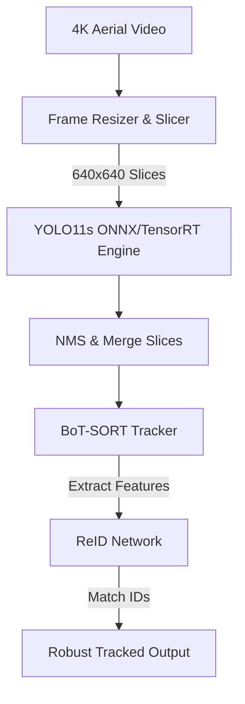
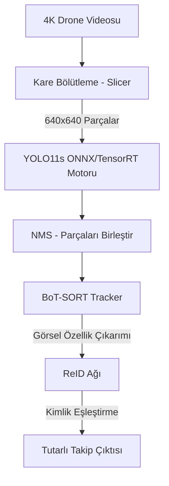

[English](#english-version) | [Türkçe](#türkçe-sürüm)

---

# <a id="english-version"></a> 🚁 Aerial Vision with VİSDRONE: Advanced Drone Tracking with SAHI, YOLO11 & TensorRT


**Aerial Vision with VİSDRONE** is a high-performance object detection and tracking pipeline optimized for aerial drone imagery. The project addresses the challenges of small object detection, dense clustering, and dynamic occlusion by integrating **YOLO11**, **SAHI (Slicing Aided Hyper Inference)**, and **BoT-SORT**.

## 🌟 Features

* **Small Object Detection:** Utilizes SAHI to slice high-resolution frames into overlapping patches, preventing the loss of pixel data inherent to standard image downscaling.
* **Robust Object Tracking:** Implements BoT-SORT combined with a Re-Identification (ReID) network (`yolo26n-reid.onnx`) for persistent identity tracking across occlusions.
* **High-Speed Inference:** Features dynamic TensorRT (FP16) compilation and ONNX Runtime CUDA Execution Provider integration.
* **Adaptive Frame-Skipping:** Leverages Kalman Filter predictions during skipped frames to maintain tracking continuity while significantly increasing throughput.

## 📊 Performance & Metrics

### 1. Object Detection (YOLO11s)
The underlying detection model was fine-tuned on the VisDrone DET dataset.

| Configuration | mAP@50 | mAP@50-95 | Precision | Recall |
| :--- | :---: |:---------:| :---: | :---: |
| Base YOLO11n | ~0.27 |   ~0.14   | ~0.25 | ~0.23 |
| Base YOLO11s | ~0.44 |   ~0.22   | ~0.38 | ~0.40 |
| **YOLO11s + SAHI** | **~0.46** | **~0.27** | **~0.42** | **~0.44** |

### 2. Tracking Pipeline (SAHI + BoT-SORT)
Evaluated on the VisDrone MOT dataset (IoU >= 0.5).

| Tracking Pipeline | Micro F1 Score | Micro Recall | Car F1 | Pedestrian F1 |
| :--- | :---: | :---: | :---: | :---: |
| Standard YOLO11 Tracker | ~0.50 | ~0.45 | ~0.65 | ~0.35 |
| **YOLO11s + SAHI + BoT-SORT** | **~0.75** | **~0.72** | **~0.88** | **~0.60** |

### 3. Inference Speeds (RTX 3050 Ti)
| Mode | Pipeline | Average FPS |
| :--- | :--- | :---: |
| High Speed | Native TensorRT (`tracking_speed_test.py`) | ~65 - 75 FPS |
| High Accuracy | SAHI Tracker with Frame-Skip (`sahi_tracker.py`) | ~25 - 30 FPS |

## 🛠️ Architecture



## 🚀 Installation & Usage

1. Clone the repository and install dependencies.
2. Export the trained model to TensorRT:
   ```python
   from ultralytics import YOLO
   YOLO('runs/detect/train-6/weights/best.pt').export(format='engine', half=True)
   ```
3. Run the SAHI Tracker (High Accuracy):
   ```bash
   python sahi_tracker.py
   ```
4. Run the Standard Tracker (High Speed):
   ```bash
   python tracking_speed_test.py
   ```

---
---

# <a id="türkçe-sürüm"></a> 🚁 VİSDRONE ile Aerial Vision: SAHI, YOLO11 ve TensorRT ile Gelişmiş Drone Nesne Takibi


**VİSDRONE ile Aerial Vision**, drone (havadan) görüntüleri için optimize edilmiş yüksek performanslı bir nesne tespiti ve takip (tracking) mimarisidir. Proje; küçük nesne tespiti, yoğun kalabalıklar ve dinamik engelleme sorunlarını **YOLO11**, **SAHI (Slicing Aided Hyper Inference)** ve **BoT-SORT** entegrasyonu ile çözmektedir.

## 🌟 Özellikler

* **Küçük Nesne Tespiti:** Yüksek çözünürlüklü kareleri örtüşen yamalara bölmek için SAHI kullanır, böylece standart görüntü küçültmenin neden olduğu veri kaybını önler.
* **Kararlı Nesne Takibi:** Kapanmalara (occlusion) karşı dayanıklı kimlik takibi için BoT-SORT algoritmasını Re-Identification (ReID) ağı (`yolo26n-reid.onnx`) ile birleştirir.
* **Yüksek Çıkarım Hızı:** Dinamik TensorRT (FP16) derlemesi ve ONNX Runtime CUDA entegrasyonu sunar.
* **Akıllı Kare Atlama (Frame-Skipping):** Atlanan karelerde Kalman Filtresi tahminlerini kullanarak sistem hızını (FPS) artırırken takip sürekliliğini korur.

## 📊 Performans ve Metrikler

### 1. Nesne Tespiti (YOLO11s)
Temel tespit modeli VisDrone DET veri setinde eğitilmiştir.

| Konfigürasyon | mAP@50 | mAP@50-95 | Precision | Recall |
| :--- | :---: |:---------:| :---: | :---: |
| Base YOLO11n | ~0.27 |   ~0.14   | ~0.25 | ~0.23 |
| Base YOLO11s | ~0.44 |   ~0.22   | ~0.38 | ~0.40 |
| **YOLO11s + SAHI** | **~0.46** | **~0.27** | **~0.42** | **~0.44** |

### 2. Takip (Tracking) Boru Hattı (SAHI + BoT-SORT)
VisDrone MOT veri setinde değerlendirilmiştir (IoU >= 0.5).

| Takip (Tracking) Boru Hattı | Micro F1 Score | Micro Recall | Car F1 | Pedestrian F1 |
| :--- | :---: | :---: | :---: | :---: |
| Standart YOLO11 Tracker | ~0.50 | ~0.45 | ~0.65 | ~0.35 |
| **YOLO11s + SAHI + BoT-SORT** | **~0.75** | **~0.72** | **~0.88** | **~0.60** |

### 3. Çıkarım Hızları (RTX 3050 Ti)
| Mod | Boru Hattı (Pipeline) | Ortalama FPS |
| :--- | :--- | :---: |
| Yüksek Hız | Native TensorRT (`tracking_speed_test.py`) | ~65 - 75 FPS |
| Yüksek Doğruluk | Frame-Skip'li SAHI Tracker (`sahi_tracker.py`) | ~25 - 30 FPS |

## 🛠️ Mimari



## 🚀 Kurulum ve Çalıştırma

1. Projeyi klonlayın ve gereksinimleri yükleyin.
2. Eğitilmiş modeli TensorRT'ye dönüştürün:
   ```python
   from ultralytics import YOLO
   YOLO('runs/detect/train-6/weights/best.pt').export(format='engine', half=True)
   ```
3. SAHI Tracker'ı çalıştırın (Yüksek Doğruluk):
   ```bash
   python sahi_tracker.py
   ```
4. Standart Tracker'ı çalıştırın (Yüksek Hız):
   ```bash
   python tracking_speed_test.py
   ```
