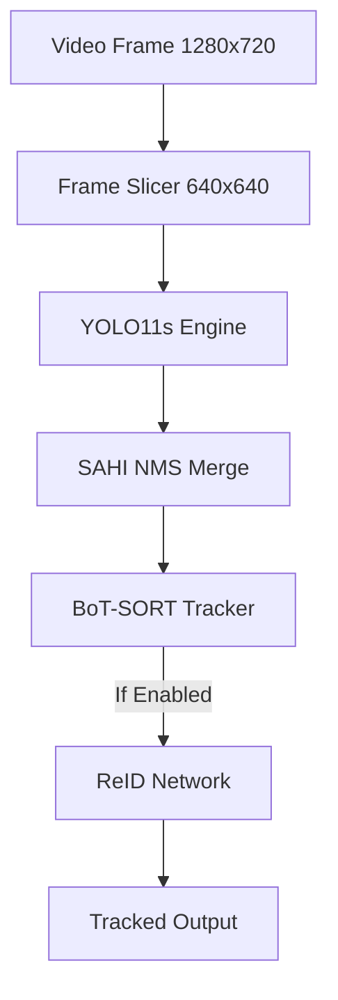
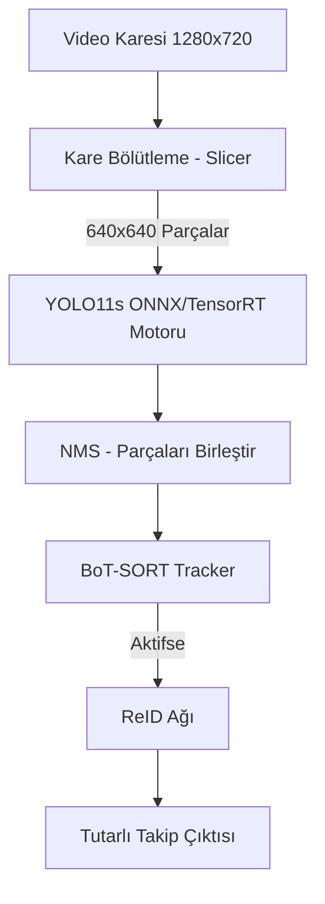

[English](#english-version) | [Türkçe](#türkçe-sürüm)

---

# <a id="english-version"></a> 🚁VİSDRONE Detection & Tracking: YOLO11s + SAHI + BoT-SORT


An experiment in small-object detection and multi-object tracking (MOT) on aerial drone footage. It uses a YOLO11s model fine-tuned on the VisDrone DET dataset, SAHI (slicing-aided inference) for small objects, and Ultralytics' BoT-SORT for tracking. Detection runs every N frames to optimize inference speeds.

## 📁 Repository Structure

| File | Purpose |
| :--- | :--- |
| `sahi_tracker.py` | **High accuracy mode:** SAHI + BoT-SORT with frame skipping. |
| `tracking_speed_test.py` | **High speed mode:** Plain YOLO + ByteTrack speed test, no SAHI. |
| `runs/detect/train-6/weights/best.pt` | YOLO11s weights fine-tuned on VisDrone DET. |
| `yolo26n-reid.onnx` | ReID (appearance) model for BoT-SORT. |
| `tools/`, `error_analysis/` | Helper scripts, evaluation tools, and error-analysis outputs. |

## ⚙️ How It Works

* **`sahi_tracker.py` (SAHI + BoT-SORT):**
  - Each video frame is read and resized to 1280×720 (a downscale for 4K sources).
  - Every 3rd frame (`DETECT_EVERY_N = 3`) is sliced into 640×640 tiles (10% overlap), YOLO11s runs on each tile, and SAHI merges the results.
  - Detections are fed to BoT-SORT (camera motion compensation: `sparseOptFlow`).
  - On frames without detection, the last detections are fed to the tracker again.
  - ReID is disabled by default (`USE_REID = False`). Set it to `True` at the top of the file to use `yolo26n-reid.onnx`.
* **`tracking_speed_test.py` (Speed Test):**
  - Runs `best.pt` with PyTorch FP16 (`half=True`) at `imgsz=640`.
  - Tracks with ByteTrack via `model.track()`; no SAHI, no ReID.
  - Resizes frames to 1280×720.
  - The reported FPS covers only the `model.track()` call (excluding video decoding, resizing, and display).

## 📊 Results

### Detection (VisDrone DET)
| Configuration | mAP@50 | mAP@50-95 | Precision | Recall |
| :--- | :---: | :---: | :---: | :---: |
| Base YOLO11n | ~0.27 | ~0.14 | ~0.25 | ~0.23 |
| Base YOLO11s | ~0.44 | ~0.22 | ~0.38 | ~0.40 |
| **YOLO11s + SAHI** | **~0.46** | **~0.27** | **~0.42** | **~0.44** |

### Tracking Pipeline (VisDrone MOT, IoU ≥ 0.5)
| Pipeline | Micro F1 | Micro Recall | Car F1 | Pedestrian F1 |
| :--- | :---: | :---: | :---: | :---: |
| Standard YOLO11 Tracker | ~0.50 | ~0.45 | ~0.65 | ~0.35 |
| **YOLO11s + SAHI + BoT-SORT** | **~0.75** | **~0.72** | **~0.88** | **~0.60** |
*Note: F1 and recall here are detection-level metrics at IoU ≥ 0.5. Tracking-quality metrics such as HOTA / IDF1 / MOTA (ID switches) are not reported.*

### Speed (RTX 3050 Ti)
| Mode | Script | Avg. FPS |
| :--- | :--- | :---: |
| High speed (PyTorch FP16, ByteTrack, no SAHI) | `tracking_speed_test.py` | ~65–75 |
| High accuracy (SAHI + BoT-SORT, frame skipping) | `sahi_tracker.py` | ~25–30 |
*Note: The two scripts measure FPS differently (one includes video decoding and resizing, the other does not) and use different trackers, so the two numbers are not directly comparable.*

## 🛠️ Architecture



## 🚀 Setup & Usage

```bash
pip install ultralytics sahi opencv-python numpy torch onnxruntime-gpu
```
In both scripts, change `VIDEO_PATH` (or `video_path`) at the top of the file to your own video. No video is included in the repo.

**Run the scripts:**
```bash
python sahi_tracker.py         # SAHI + BoT-SORT 
python tracking_speed_test.py  # Speed test
```

*(Optional)* `sahi_tracker.py` first looks for `runs/detect/train-6/weights/best.engine` or `.onnx` and falls back to `best.pt`. To create an optimized engine:
```python
from ultralytics import YOLO
YOLO('runs/detect/train-6/weights/best.pt').export(format='engine', half=True, device=0)
```

## ⚠️ Known Limitations
* `DETECT_EVERY_N = 1` currently does not work (the detection condition is never true); use 2 or higher.
* On frames without detection, previous detections are re-fed to the tracker; this is not a pure Kalman prediction and may cause lag or jitter on fast-moving objects.
* SAHI runs on a frame downscaled to 1280×720, not on the full 4K frame, so the benefit for small objects may be smaller than with full resolution.
* Scripts contain an absolute Windows video path, and the `PATH` tweak for ONNX Runtime only works on Windows.
* There is no `requirements.txt`; package versions are not pinned.
* The on-screen "ONNX+TRT" label is derived from the file extension and does not guarantee TensorRT is actually used.

## 📚 Dataset
[VisDrone](https://github.com/VisDrone/VisDrone-Dataset): Drone-captured imagery with 10 classes (pedestrian, people, bicycle, car, van, truck, tricycle, awning-tricycle, bus, motor).

---
---

# <a id="türkçe-sürüm"></a> 🚁 VİSDRONE Detection & Tracking: YOLO11s + SAHI + BoT-SORT


Drone (havadan) görüntülerinde küçük nesne tespiti ve çoklu nesne takibi (MOT) denemesi. VisDrone DET veri seti üzerinde fine-tune edilmiş bir YOLO11s modeli, küçük nesneler için SAHI (dilimleme tabanlı çıkarım) ve takip için Ultralytics'in BoT-SORT uygulaması kullanılır. Hız için tespit her N karede bir çalıştırılır.

## 📁 Depodaki Dosyalar

| Dosya | Ne Yapar |
| :--- | :--- |
| `sahi_tracker.py` | **Yüksek doğruluk modu:** SAHI + BoT-SORT, kare atlamalı. |
| `tracking_speed_test.py` | **Yüksek hız modu:** SAHI olmadan, YOLO + ByteTrack hız testi. |
| `runs/detect/train-6/weights/best.pt` | VisDrone DET üzerinde eğitilmiş YOLO11s ağırlıkları. |
| `yolo26n-reid.onnx` | BoT-SORT için ReID (görünüm) modeli. |
| `tools/`, `error_analysis/` | Yardımcı araçlar ve hata analizi çıktıları. |

## ⚙️ Nasıl Çalışır?

* **`sahi_tracker.py` (SAHI + BoT-SORT):**
  - Videodan kare okunur ve 1280×720'ye küçültülür (4K kaynak için bu bir küçültmedir).
  - Her 3 karede bir (`DETECT_EVERY_N = 3`) kare 640×640 dilimlere bölünür (örtüşme %10) ve YOLO11s her dilimde çalıştırılır; sonuçlar SAHI ile birleştirilir.
  - Tespitler BoT-SORT'a verilir (kamera hareketi telafisi: `sparseOptFlow`).
  - Tespit yapılmayan karelerde son tespitler önbellekten tekrar tracker'a verilir.
  - ReID varsayılan olarak kapalıdır (`USE_REID = False`). Açmak için dosyanın başındaki ayarı `True` yapın; `yolo26n-reid.onnx` kullanılır.
* **`tracking_speed_test.py` (Hız Testi):**
  - `best.pt` modelini PyTorch ile FP16 çalıştırır (`half=True`), `imgsz=640`.
  - Takip için `model.track()` ile ByteTrack kullanır, SAHI ve ReID yoktur.
  - Kareyi 1280×720'ye küçültür.
  - Raporlanan FPS yalnızca `model.track()` süresini ölçer (video okuma, yeniden boyutlandırma ve ekrana çizim hariç).

## 📊 Sonuçlar

### Nesne Tespiti (VisDrone DET)
| Konfigürasyon | mAP@50 | mAP@50-95 | Precision | Recall |
| :--- | :---: | :---: | :---: | :---: |
| Base YOLO11n | ~0.27 | ~0.14 | ~0.25 | ~0.23 |
| Base YOLO11s | ~0.44 | ~0.22 | ~0.38 | ~0.40 |
| **YOLO11s + SAHI** | **~0.46** | **~0.27** | **~0.42** | **~0.44** |

### Takip Hattı (VisDrone MOT, IoU ≥ 0.5)
| Hat | Micro F1 | Micro Recall | Car F1 | Pedestrian F1 |
| :--- | :---: | :---: | :---: | :---: |
| Standart YOLO11 Tracker | ~0.50 | ~0.45 | ~0.65 | ~0.35 |
| **YOLO11s + SAHI + BoT-SORT** | **~0.75** | **~0.72** | **~0.88** | **~0.60** |
*Not: Buradaki F1 ve Recall, IoU ≥ 0.5 eşiğinde tespit düzeyinde metriklerdir. ID switch gibi takip kalitesini ölçen HOTA / IDF1 / MOTA değerleri raporlanmamıştır.*

### Hız (RTX 3050 Ti)
| Mod | Betik | Ortalama FPS |
| :--- | :--- | :---: |
| Yüksek hız (PyTorch FP16, ByteTrack, SAHI yok) | `tracking_speed_test.py` | ~65–75 |
| Yüksek doğruluk (SAHI + BoT-SORT, kare atlamalı) | `sahi_tracker.py` | ~25–30 |
*Not: İki betik FPS'i farklı şekilde ölçer (biri video okuma ve yeniden boyutlandırmayı da sayar, diğeri saymaz) ve farklı takipçiler kullanır. Bu iki sayı birbiriyle birebir kıyaslanamaz.*

## 🛠️ Mimari



## 🚀 Kurulum ve Çalıştırma

```bash
pip install ultralytics sahi opencv-python numpy torch onnxruntime-gpu
```
Her iki betikte de dosyanın başındaki `VIDEO_PATH` değişkenini kendi videonuzun yoluyla değiştirin. Video depoda bulunmaz.

**Çalıştırın:**
```bash
python sahi_tracker.py         # SAHI + BoT-SORT 
python tracking_speed_test.py  # Hız testi
```

*(İsteğe bağlı)* `sahi_tracker.py` önce `runs/detect/train-6/weights/best.engine` veya `.onnx` dosyasını arar, bulamazsa `best.pt`'ye geçer. Optimize edilmiş motor (.engine) üretmek için:
```python
from ultralytics import YOLO
YOLO('runs/detect/train-6/weights/best.pt').export(format='engine', half=True, device=0)
```

## ⚠️ Bilinen Sınırlamalar
* `DETECT_EVERY_N = 1` ayarı şu an çalışmaz (tespit koşulu hiç sağlanmaz); 2 ve üzeri değerler kullanın.
* Tespit yapılmayan karelerde tracker'a önceki tespitler tekrar verilir; bu saf bir Kalman tahmini değildir ve hızlı hareket eden nesnelerde kutularda gecikme veya titreme olabilir.
* SAHI, 4K kare yerine 1280×720'ye küçültülmüş kare üzerinde çalışır; küçük nesneler için tam çözünürlük kadar kazanç sağlamayabilir.
* Betiklerde mutlak (Windows) video yolu vardır ve ONNX Runtime için `PATH` ayarı (DLL hack'i) yalnızca Windows'ta çalışır.
* `requirements.txt` yoktur; paket sürümleri sabitlenmemiştir.
* Ekrandaki "ONNX+TRT" etiketi dosya uzantısına göre yazılır; TensorRT'nin gerçekten kullanıldığını garanti etmez.

## 📚 Kullanılan Veri Seti
[VisDrone](https://github.com/VisDrone/VisDrone-Dataset): Drone ile çekilmiş görüntülerde 10 sınıf (pedestrian, people, bicycle, car, van, truck, tricycle, awning-tricycle, bus, motor).
